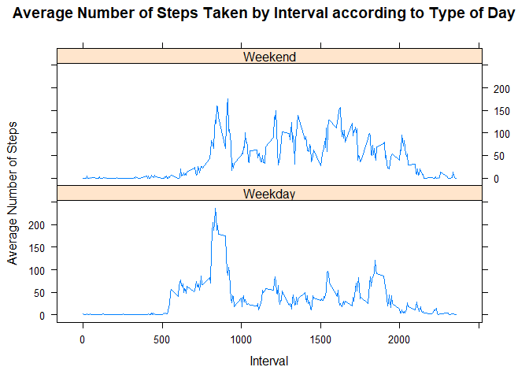

## Introduction

It is now possible to collect a large amount of data about personal
movement using activity monitoring devices such as a
[Fitbit](http://www.fitbit.com), [Nike
Fuelband](http://www.nike.com/us/en_us/c/nikeplus-fuelband), or
[Jawbone Up](https://jawbone.com/up). These type of devices are part of
the "quantified self" movement -- a group of enthusiasts who take
measurements about themselves regularly to improve their health, to
find patterns in their behavior, or because they are tech geeks. But
these data remain under-utilized both because the raw data are hard to
obtain and there is a lack of statistical methods and software for
processing and interpreting the data.

This assignment makes use of data from a personal activity monitoring
device. This device collects data at 5 minute intervals through out the
day. The data consists of two months of data from an anonymous
individual collected during the months of October and November, 2012
and include the number of steps taken in 5 minute intervals each day.

## Data

The data for this assignment can be downloaded from the course web
site:

* Dataset: [Activity monitoring data](https://d396qusza40orc.cloudfront.net/repdata%2Fdata%2Factivity.zip) [52K]

The variables included in this dataset are:

* **steps**: Number of steps taking in a 5-minute interval (missing
    values are coded as `NA`)

* **date**: The date on which the measurement was taken in YYYY-MM-DD
    format

* **interval**: Identifier for the 5-minute interval in which
    measurement was taken


The dataset is stored in a comma-separated-value (CSV) file and there
are a total of 17,568 observations in this
dataset.


## Assignment

This assignment will be described in multiple parts. You will need to
write a report that answers the questions detailed below. Ultimately,
you will need to complete the entire assignment in a **single R
markdown** document that can be processed by **knitr** and be
transformed into an HTML file.

Throughout your report make sure you always include the code that you
used to generate the output you present. When writing code chunks in
the R markdown document, always use `echo = TRUE` so that someone else
will be able to read the code. **This assignment will be evaluated via
peer assessment so it is essential that your peer evaluators be able
to review the code for your analysis**.

For the plotting aspects of this assignment, feel free to use any
plotting system in R (i.e., base, lattice, ggplot2)

Fork/clone the [GitHub repository created for this
assignment](http://github.com/rdpeng/RepData_PeerAssessment1). You
will submit this assignment by pushing your completed files into your
forked repository on GitHub. The assignment submission will consist of
the URL to your GitHub repository and the SHA-1 commit ID for your
repository state.

NOTE: The GitHub repository also contains the dataset for the
assignment so you do not have to download the data separately.

### **REPORTED ANSWERS ARE IN BOLD**

### Loading and preprocessing the data
Load necessary packages and unzip data


```r
library(data.table)
library(plyr)
library(ggplot2)
library(lattice)

unzip("activity.zip")

data <- read.csv("activity.csv")
data$day <- weekdays(as.Date(data$date))
data$DateTime<- as.POSIXct(data$date, format="%Y-%m-%d")
```

### What is mean total number of steps taken per day?

1) Calculate while ignoring missing values in data set
2) Create histogram
3) Calculate mean and median


```r
## calculate total number of steps taken per day
sumdata <- aggregate(data$steps ~ data$date, FUN=sum, )
colnames(sumdata)<- c("Date", "Steps")
color_range <- 2:(length(sumdata$Steps)+1) ## set color for histogram
summary(sumdata)
```

```
##          Date        Steps      
##  2012-10-02: 1   Min.   :   41  
##  2012-10-03: 1   1st Qu.: 8841  
##  2012-10-04: 1   Median :10765  
##  2012-10-05: 1   Mean   :10766  
##  2012-10-06: 1   3rd Qu.:13294  
##  2012-10-07: 1   Max.   :21194  
##  (Other)   :47
```

```r
## plot
hist(sumdata$Steps, breaks=5, xlab="Steps", col = color_range, main = "Total Number of Steps per Day")
```

<!-- -->

```r
## calculate mean and median
as.integer(mean(sumdata$Steps))
```

```
## [1] 10766
```

```r
as.integer(median(sumdata$Steps))
```

```
## [1] 10765
```
**Mean of the total number of steps taken per day is 10,766.**

**Median of the total number of steps taken per day is 10,765.**

### What is the average daily activity pattern?

1) create data which removes missing values
2) calculate average
3) create time series plot
4) calculate which 5-minute interval contains the maximum number of steps

```r
## create data removing missing values
data1 <- data[!is.na(data$steps),]
summary(data1)
```

```
##      steps                date          interval          day           
##  Min.   :  0.00   2012-10-02:  288   Min.   :   0.0   Length:15264      
##  1st Qu.:  0.00   2012-10-03:  288   1st Qu.: 588.8   Class :character  
##  Median :  0.00   2012-10-04:  288   Median :1177.5   Mode  :character  
##  Mean   : 37.38   2012-10-05:  288   Mean   :1177.5                     
##  3rd Qu.: 12.00   2012-10-06:  288   3rd Qu.:1766.2                     
##  Max.   :806.00   2012-10-07:  288   Max.   :2355.0                     
##                   (Other)   :13536                                      
##     DateTime                  
##  Min.   :2012-10-02 00:00:00  
##  1st Qu.:2012-10-16 00:00:00  
##  Median :2012-10-29 00:00:00  
##  Mean   :2012-10-30 17:37:21  
##  3rd Qu.:2012-11-16 00:00:00  
##  Max.   :2012-11-29 00:00:00  
## 
```

```r
nrow(data1)
```

```
## [1] 15264
```

```r
## create average data
intervaldata <- ddply(data1, .(interval), summarize, Avg = mean(steps))

ggplot(intervaldata, aes(x=interval, y=Avg), xlab = "Interval", ylab="Average Number of Steps") +
  geom_line(color="blue")+
  xlab("Interval")+
  ylab("Average Number of Steps") +
  ggtitle("Average Number of Steps Taken by Interval")
```

<!-- -->

```r
## calculate interval containing max number of steps
maximum <- max(intervaldata$Avg)
intervaldata[intervaldata$Avg==maximum,1]
```

```
## [1] 835
```
**Interval 835 contains the maximum number of steps.**

### Imputing missing values

1) Calculate and report total number of missing values in the dataset


```r
nrow(data[is.na(data$steps),])
```

```
## [1] 2304
```
**There are 2,304 missing values.** 

2) Fill in missing values using mean of 5-minute interval

```r
## calculate average number of steps per weekday and interval
avgdata <- ddply(data1, .(interval, day), summarize, Avg = mean(steps))
## create dataset with all missing data for fill-in
data2<- data[is.na(data$steps),]
nrow(data2) ## how many rows in data2
```

```
## [1] 2304
```

```r
## using previously created non-missing dataset (data1) and avgdata, impute missing values
data3<-merge(data2, avgdata, by=c("interval", "day"))
summary(data3)
```

```
##     interval          day                steps              date    
##  Min.   :   0.0   Length:2304        Min.   : NA    2012-10-01:288  
##  1st Qu.: 588.8   Class :character   1st Qu.: NA    2012-10-08:288  
##  Median :1177.5   Mode  :character   Median : NA    2012-11-01:288  
##  Mean   :1177.5                      Mean   :NaN    2012-11-04:288  
##  3rd Qu.:1766.2                      3rd Qu.: NA    2012-11-09:288  
##  Max.   :2355.0                      Max.   : NA    2012-11-10:288  
##                                      NA's   :2304   (Other)   :576  
##     DateTime                        Avg        
##  Min.   :2012-10-01 00:00:00   Min.   :  0.00  
##  1st Qu.:2012-10-26 00:00:00   1st Qu.:  0.00  
##  Median :2012-11-06 11:30:00   Median : 12.14  
##  Mean   :2012-11-01 21:30:00   Mean   : 38.84  
##  3rd Qu.:2012-11-11 00:00:00   3rd Qu.: 59.32  
##  Max.   :2012-11-30 00:00:00   Max.   :328.57  
## 
```

```r
nrow(data3)
```

```
## [1] 2304
```

3) create new dataset with missing values filled in

```r
## reorder new data (data2) for easing merging
data4<- data3[,c(6,4,1,2,5)]
colnames(data4)<- c("steps", "date", "interval", "day", "DateTime")
summary(data4)
```

```
##      steps                date        interval          day           
##  Min.   :  0.00   2012-10-01:288   Min.   :   0.0   Length:2304       
##  1st Qu.:  0.00   2012-10-08:288   1st Qu.: 588.8   Class :character  
##  Median : 12.14   2012-11-01:288   Median :1177.5   Mode  :character  
##  Mean   : 38.84   2012-11-04:288   Mean   :1177.5                     
##  3rd Qu.: 59.32   2012-11-09:288   3rd Qu.:1766.2                     
##  Max.   :328.57   2012-11-10:288   Max.   :2355.0                     
##                   (Other)   :576                                      
##     DateTime                  
##  Min.   :2012-10-01 00:00:00  
##  1st Qu.:2012-10-26 00:00:00  
##  Median :2012-11-06 11:30:00  
##  Mean   :2012-11-01 21:30:00  
##  3rd Qu.:2012-11-11 00:00:00  
##  Max.   :2012-11-30 00:00:00  
## 
```

```r
nrow(data4)
```

```
## [1] 2304
```

```r
## combine non-missing dataset (data1) and reordered filled-in average dataset (data4)
newdata <- rbind(data1, data4)
nrow(newdata) ## verify number of rows in new dataset
```

```
## [1] 17568
```

```r
summary(newdata)
```

```
##      steps                date          interval          day           
##  Min.   :  0.00   2012-10-01:  288   Min.   :   0.0   Length:17568      
##  1st Qu.:  0.00   2012-10-02:  288   1st Qu.: 588.8   Class :character  
##  Median :  0.00   2012-10-03:  288   Median :1177.5   Mode  :character  
##  Mean   : 37.57   2012-10-04:  288   Mean   :1177.5                     
##  3rd Qu.: 19.04   2012-10-05:  288   3rd Qu.:1766.2                     
##  Max.   :806.00   2012-10-06:  288   Max.   :2355.0                     
##                   (Other)   :15840                                      
##     DateTime                  
##  Min.   :2012-10-01 00:00:00  
##  1st Qu.:2012-10-16 00:00:00  
##  Median :2012-10-31 00:00:00  
##  Mean   :2012-10-31 00:25:34  
##  3rd Qu.:2012-11-15 00:00:00  
##  Max.   :2012-11-30 00:00:00  
## 
```

4) create a histogram of total number of steps taken each day and Calculate and report the mean and median total number of steps taken per day. Do these values differ from the estimates from the first part of the assignment? What is the impact of imputing missing data on the estimates of the total daily number of steps?

```r
## calculate total number of steps taken per day of newdata
sumdata2 <- aggregate(newdata$steps ~ newdata$date, FUN=sum, )
colnames(sumdata2)<- c("Date", "Steps")
summary(sumdata2)
```

```
##          Date        Steps      
##  2012-10-01: 1   Min.   :   41  
##  2012-10-02: 1   1st Qu.: 8918  
##  2012-10-03: 1   Median :11015  
##  2012-10-04: 1   Mean   :10821  
##  2012-10-05: 1   3rd Qu.:12811  
##  2012-10-06: 1   Max.   :21194  
##  (Other)   :55
```

```r
## calculate mean and median
as.integer(mean(sumdata2$Steps))
```

```
## [1] 10821
```

```r
as.integer(median(sumdata2$Steps))
```

```
## [1] 11015
```

```r
## new histogram
color_range1 <- 2:(length(sumdata2$Steps)+1)
hist(sumdata2$Steps, breaks=5, xlab="Steps", main = "Total Number of Steps per Day for New Data", col = color_range1)
```

<!-- -->

**New mean of the total number of steps taken per day is 10,821.**

**New median of the total number of steps taken per day is 11,015.**

**These numbers are different by 55 and 250 steps, respectively from the previouly calculated figures in the second part of assignment.**
**The distribution is same but we can see from histogram that the frequencies has increased with the new data (missing filled-in).Specifically, we have more observations in the 5,000-10,000 and 10,000-15,000 intervals in the new dataset.**

## Are there differences in activity paatterns between weekdays and weekends?

For this part the weekdays() function may be of some help here. Use the dataset with the filled-in missing values for this part.

1) Create a new factor variable in the dataset with two levels – “weekday” and “weekend” indicating whether a given date is a weekday or weekend day.

2) Make a panel plot containing a time series plot (i.e. type = "l") of the 5-minute interval (x-axis) and the average number of steps taken, averaged across all weekday days or weekend days (y-axis). See the README file in the GitHub repository to see an example of what this plot should look like using simulated data.


```r
## new factor variable
newdata$DayType <- ifelse(newdata$day %in% c("Saturday", "Sunday"), "Weekend", "Weekday")

## create new average data
intervaldata2 <- ddply(newdata, .(interval, DayType), summarize, Avg = mean(steps))

## plot by type of day
xyplot(Avg~interval|DayType, data=intervaldata2, type="l",  layout = c(1,2),
       main="Average Number of Steps Taken by Interval according to Type of Day", 
       ylab="Average Number of Steps", xlab="Interval")
```

<!-- -->

